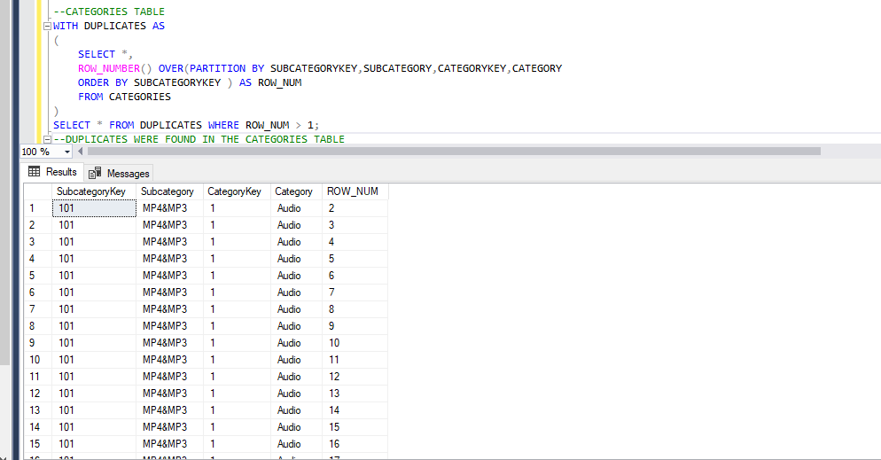
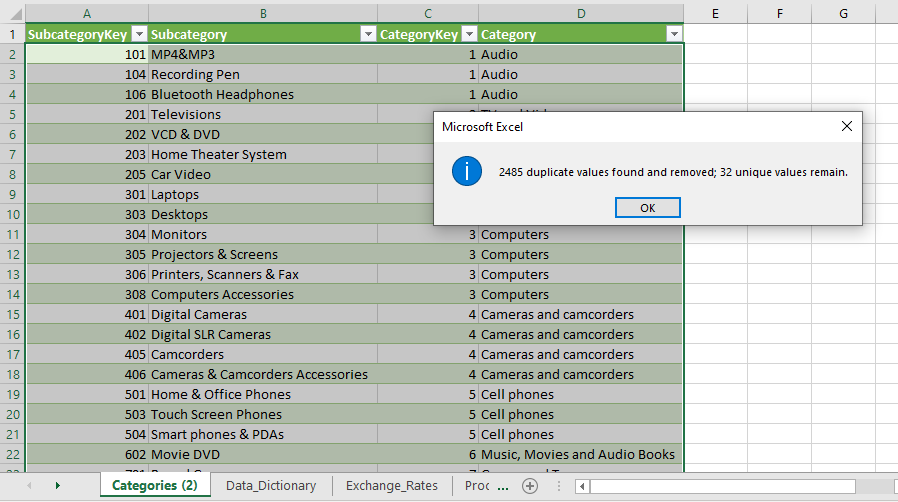
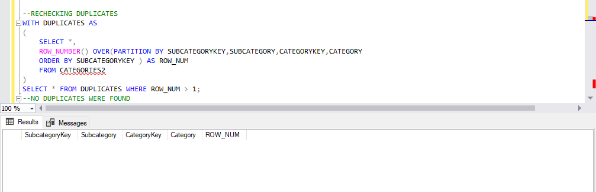

# EMPOVATION_JUNE_SQL_CHALLENGE
# INTRODUCTION
# DATA CLEANING
####  REMOVING DUPLICATES; I CHEACKED FOR DUPLICATES IN EVERY TABLE, THE CATEGORIES TABLE WAS THE ONLY TABLE WITH DUPLICATES

### I CLEANED THE TABLE IN MICROSOFT EXCEL

### RECHEACKED FOR DUPLICATES

## EXPLORATORY DATA ANALYSIS
#### QUESTION 1:Write a query to count the total number of orders per customer order in desc
`SELECT C.NAME, COUNT(DISTINCT ORDER_NUMBER) AS TOTAL_ORDERS
FROM CUSTOMERS C
JOIN SALES S 
ON C.CUSTOMERKEY = S.CUSTOMERKEY
GROUP BY C.NAME
ORDER BY COUNT(DISTINCT ORDER_NUMBER) DESC;`

#### QUESTION 2: Write a SQL Query to list the products sold in 2020
`SELECT DISTINCT P.PRODUCT_NAME 
FROM PRODUCTS P JOIN SALES S 
ON P.PRODUCTKEY = S.PRODUCTKEY 
WHERE YEAR(ORDER_DATE) = 2020;`

#### QUESTION 3: Write a query to find all customer details from califonia
`SELECT CUSTOMERKEY, NAME, CITY, STATE 
FROM CUSTOMERS
WHERE STATE = 'CALIFORNIA';`

#### QUESTION 4:Write a query to calculate the total sales quantity f0r products 2115
`SELECT P.PRODUCT_NAME, P.PRODUCTKEY, SUM(QUANTITY) AS TOTAL_SALES_QUANTITY 
FROM PRODUCTS P 
JOIN SALES S
ON P.PRODUCTKEY = S.PRODUCTKEY
WHERE  P.PRODUCTKEY = 2115
GROUP BY P.PRODUCTKEY, P.PRODUCT_NAME;`

#### QUESTION 5:Write a query to retrive the top 5 stores with the most sales tranasactions
`SELECT TOP 5 ST.STOREKEY, COUNT(*) AS NUMBER_OF_TRANASACTIONS 
FROM STORES ST JOIN SALES S
ON ST.STOREKEY = S.STOREKEY
GROUP BY ST.STOREKEY
ORDER BY  NUMBER_OF_TRANASACTIONS DESC;`

#### QUESTION 6: Write a query to find the average price of products in each category
`SELECT CATEGORY, AVG(UNIT_PRICE_USD) AS AVG_PRICE_OF_PRODUCTS_CATEGORY
FROM PRODUCTS
GROUP BY CATEGORY;`

#### QUESTION 7:Write a query to count the numbers of orders placed by each gender
`SELECT COUNT(DISTINCT ORDER_NUMBER) AS NUMBER_OF_ORDERS, GENDER 
FROM SALES S JOIN CUSTOMERS C
ON S.CUSTOMERKEY = C.CUSTOMERKEY
GROUP BY GENDER
ORDER BY COUNT(DISTINCT ORDER_NUMBER) DESC;`

#### QUESTION 8:SELECT P.PRODUCTKEY,P.PRODUCT_NAME
`FROM PRODUCTS P
LEFT JOIN SALES S 
ON P.PRODUCTKEY = S.PRODUCTKEY
WHERE S.PRODUCTKEY IS NULL;`

#### QUESTION 9:Write a query to show the total amounts in usd, round to 2 decomal points for orders made in other currencies, using the exchange rate table to convert the prices
`SELECT S.ORDER_NUMBER,ROUND(SUM(S.QUANTITY * P.UNIT_PRICE_USD * COALESCE(E.EXCHANGE,1)),2) AS TOTAL_ORDER_IN_USD
FROM PRODUCTS  P 
JOIN SALES S
	ON P.PRODUCTKEY = S.PRODUCTKEY
LEFT JOIN EXCHANGE_RATES E 
	ON S.CURRENCY_CODE = E.CURRENCY AND S.ORDER_DATE = E.DATE
GROUP BY S.ORDER_NUMBER;`

#### QUESTION 10:WRITE A QUERY TO ANALYZE WHETHER LARGER STORES IN TERMS OF SQUARE METERS ) HAVE HIGHER SALES VOLUMES.
`SELECT ST.STOREKEY,ST.SQUARE_METERS, SUM(QUANTITY)  AS SALES_VOLUME,AVG(QUANTITY) AS AVG_SALES_VOLUME
FROM STORES ST JOIN SALES S		
	ON ST.STOREKEY = S.STOREKEY JOIN PRODUCTS P
		ON P.PRODUCTKEY = S.PRODUCTKEY
		WHERE ST.STOREKEY != 0
GROUP BY ST.STOREKEY, SQUARE_METERS
ORDER BY ST.SQUARE_METERS DESC;`

#### QUESTION 11:WRITE A QUERY TO SEGMENT CUSTOMERS INTO GROUPS BASED ON THIER PURCHASE BEHAVIORS
`SELECT C.CUSTOMERKEY, C.NAME, C.GENDER, C.STATE, COUNT(S.ORDER_NUMBER) AS NUMBER_OF_ORDER, SUM(S.QUANTITY*P.UNIT_PRICE_USD) AS TOTAL_SPEND,
CASE
	WHEN SUM( S.QUANTITY * P.UNIT_PRICE_USD) > 1000 THEN 'HIGH SPENDER'
	WHEN SUM( S.QUANTITY * P.UNIT_PRICE_USD) BETWEEN 500 AND 1000 THEN 'MEDUIM SPENDER'
	ELSE 'LOW SPENDER'
END AS SPEND_CATEGORY,
CASE 
	WHEN COUNT(S.ORDER_NUMBER) > 10 THEN 'ODOGWU'
	WHEN COUNT (S.ORDER_NUMBER) BETWEEN 5 AND 10  THEN 'MAKE I CHOP FIRST'
	ELSE 'GOD ABEG'
END AS BUY_CATEGORY
FROM CUSTOMERS C
JOIN SALES S ON C.CUSTOMERKEY = S.CUSTOMERKEY
JOIN PRODUCTS P ON S.PRODUCTKEY = P.PRODUCTKEY
GROUP BY  C.CUSTOMERKEY, C.NAME, C.GENDER, C.STATE
ORDER BY TOTAL_SPEND DESC;`

#### QUESTION 12:WRITE A QUERY TO CALCULATE THE TOTAL SALES VOLUME FOR EACH STORE, THEN RANK STORES BASED ON THIER SALES VOLUME
`SELECT ST.STOREKEY,
SUM(S.QUANTITY) AS TOTAL_SALES_VOLUME,
RANK() OVER(ORDER BY  SUM(S.QUANTITY)DESC) AS SALES_RANK
FROM STORES ST
JOIN SALES S ON ST.STOREKEY = S.STOREKEY
JOIN PRODUCTS P ON P.PRODUCTKEY = S.PRODUCTKEY
GROUP BY  ST.STOREKEY
ORDER BY TOTAL_SALES_VOLUME DESC;`

#### QUESTION 13:WRITE A QUERY TO RETRIEVE DAILY SALES VOLUME THEN CALCULATE A RUNNINMG TOTAL SALES OVER TIME , OREDERED BY DATE
`SELECT S.ORDER_DATE, SUM(S.QUANTITY) AS DAILY_TOTAL_SALES_VOLUME, 
SUM(SUM(S.QUANTITY)) OVER (ORDER BY S.ORDER_DATE) AS RUNNING_TOTAL_SALES
FROM SALES S
JOIN PRODUCTS P ON S.PRODUCTKEY = P.PRODUCTKEY
GROUP BY S.ORDER_DATE
ORDER BY S.ORDER_DATE  DESC;`

#### QUESTION 14:WRITE A QUERY TO CALCULATE THE LIFETIME VALUE OF EACH CUSTOMER BASED ON THIER COUNTRY
`WITH CUSTOMER_LTV AS (
	SELECT C.CUSTOMERKEY,C.COUNTRY, SUM(S.QUANTITY * P.UNIT_PRICE_USD) AS TOTAL_SPEND
	FROM CUSTOMERS C
	JOIN SALES S ON C.CUSTOMERKEY = S.CUSTOMERKEY
	JOIN PRODUCTS P ON S.PRODUCTKEY = P.PRODUCTKEY
	GROUP BY C.CUSTOMERKEY, C.COUNTRY
	),
COUNTRY_LTV AS(
	SELECT COUNTRY, AVG(TOTAL_SPEND) AS AVERAGE_LTV
	FROM CUSTOMER_LTV 
	GROUP BY COUNTRY
	)
SELECT 
	COUNTRY,AVERAGE_LTV, RANK() OVER(ORDER BY AVERAGE_LTV DESC) AS LTVRANK
FROM COUNTRY_LTV
GROUP BY COUNTRY, AVERAGE_LTV
ORDER BY LTVRANK;`

#### QUESTION 15:WRITE A QUERY TO CALCULATE THE LIFETIME VALUE OF EACH CUSTOMER BASED ON TOTAL AMOUNT THEY'VE SPENT
`SELECT C.CUSTOMERKEY, C.NAME, SUM(S.QUANTITY * P.UNIT_PRICE_USD) AS LIFE_TIME_VALUE
FROM CUSTOMERS C
JOIN SALES S ON C.CUSTOMERKEY = S.CUSTOMERKEY
JOIN PRODUCTS P ON S.PRODUCTKEY = P.PRODUCTKEY
GROUP BY C.CUSTOMERKEY, C.NAME
ORDER BY LIFE_TIME_VALUE DESC;`

#### QUESTION 16:WRITE A QUERY TO CALCULATE THE TOTAL ANNUAL SALES PER PRODUCT CATEGORY FOR THE CURRENT YEAR AND THE PREVIOUS YEAR, AND THEN USE WINDOW FUNCTIONS TO CALCULATE THE YEAR_OVER_YEAR GROWTH PERCENTAGE
`WITH SALES_DATA AS (
	SELECT P.CATEGORYKEY, C.CATEGORY,YEAR(S.ORDER_DATE) AS ORDER_YEAR, 
			SUM(S.QUANTITY * P.UNIT_PRICE_USD) AS TOTAL_SALES
	FROM SALES S
	JOIN PRODUCTS P ON S.PRODUCTKEY = P.PRODUCTKEY
	JOIN CATEGORIES C ON P.CATEGORYKEY = C.CATEGORYKEY
	GROUP BY P.CATEGORYKEY,C.CATEGORY,YEAR (S.ORDER_DATE)
),
ANNUAL_SALES AS (
	SELECT CATEGORYKEY, CATEGORY,ORDER_YEAR,TOTAL_SALES,
			LAG(TOTAL_SALES,1) OVER (PARTITION BY CATEGORYKEY ORDER BY ORDER_YEAR) AS PREVIOUS_YEAR_SALES
	FROM SALES_DATA
)
SELECT CATEGORYKEY,CATEGORY,ORDER_YEAR,TOTAL_SALES,PREVIOUS_YEAR_SALES,
       CASE
			WHEN PREVIOUS_YEAR_SALES IS NULL THEN NULL
			ELSE ((TOTAL_SALES  - PREVIOUS_YEAR_SALES) / PREVIOUS_YEAR_SALES) * 100
		END AS YEAR_OVER_YEAR_GROWTH_PERCENTAGE
FROM ANNUAL_SALES
WHERE ORDER_YEAR IN (2020, 2021)
ORDER BY CATEGORYKEY, ORDER_YEAR;`

### QUESTION 17:WRITE A SQL QUERY TO FIND EACH CUSTOMER'S PURCHASE RANK WITHIN THE STORE THEY BOUGHT FROM, BASED ON THE TOTAL PRICE OF THE ORDER(QUANTITY * UNIT PRICE)
`WITH CUSTOMERTOTALSALES AS (
	SELECT S.CUSTOMERKEY, S.STOREKEY, SUM(S.QUANTITY * P.UNIT_PRICE_USD) AS TOTAL_PURCHASE_PRICE, 
		RANK() OVER (PARTITION BY S.CUSTOMERKEY,S.STOREKEY ORDER BY SUM(S.QUANTITY * P.UNIT_PRICE_USD) DESC) AS PURCHASE_RANK
	FROM SALES S INNER JOIN PRODUCTS P ON S.PRODUCTKEY = P.PRODUCTKEY
	GROUP BY S.CUSTOMERKEY,S.STOREKEY
	)
    SELECT C.CUSTOMERKEY, C.NAME AS CUSTOMER_NAME, S.STOREKEY, S.COUNTRY AS STORE_COUNTRY,CTS.TOTAL_PURCHASE_PRICE,CTS.PURCHASE_RANK
FROM
  CUSTOMERTOTALSALES CTS
    INNER JOIN CUSTOMERS C ON CTS.CUSTOMERKEY = C.CUSTOMERKEY
    INNER JOIN STORES S ON CTS.STOREKEY = S.STOREKEY
ORDER BY
     CTS.CUSTOMERKEY, CTS.PURCHASE_RANK;`

### QUESTION 18:CUSTOMER RETENSION ANALYSIS
`WITH FIRSTPURCHASEDATE AS (
    SELECT CUSTOMERKEY, MIN(ORDER_DATE) AS FIRST_PURCHASE_DATES
    FROM SALES
	GROUP BY CUSTOMERKEY
),
REPEAT_PURCHASES AS (
	 SELECT S.CUSTOMERKEY,COUNT(*) AS REPEAT_PURCHASE_COUNT
     FROM SALES S
			JOIN  FIRSTPURCHASEDATE FPD ON S.CUSTOMERKEY = FPD.CUSTOMERKEY
	 WHERE S.ORDER_DATE BETWEEN FPD.FIRST_PURCHASE_DATES AND DATEADD(DAY, 90, FPD.FIRST_PURCHASE_DATES)
	 GROUP BY S.CUSTOMERKEY
)
SELECT C.GENDER,  DATEDIFF(YEAR, C.BIRTHDAY, GETDATE()) AS AGE, C.CITY, C.STATE_CODE, C.COUNTRY AS CUSTOMER_COUNTRY,
		COUNT(*) AS TOTAL_CUSTOMER, COALESCE( RP.REPEAT_PURCHASE_COUNT, 0) AS RETAINED_CUSTOMERS,
		CASE 
			WHEN COUNT(*) > 0 THEN (CAST(COALESCE(RP.REPEATE_PURCHASE_COUNT, 0) AS FLOAT)/ COUNT(*)) * 100
			ELSE 0
		END AS RETENTION_RATE
FROM
  CUSTOMERS C
LEFT JOIN REPEAT_PURCHASES AS RP 
 ON C.CUSTOMERKEY = RP.CUSTOMERKEY
GROUP BY
    C.GENDER,DATEDIFF(YEAR, C.BIRTHDAY, GETDATE()),C.CITY,C.STATE_CODE,C.COUNTRY, COALESCE(RP.REPEAT_PURCHASE_COUNT, 0)
ORDER BY
   C.GENDER,DATEDIFF(YEAR, C.BIRTHDAY, GETDATE()),C.CITY,C.STATE_CODE,C.COUNTRY;`

